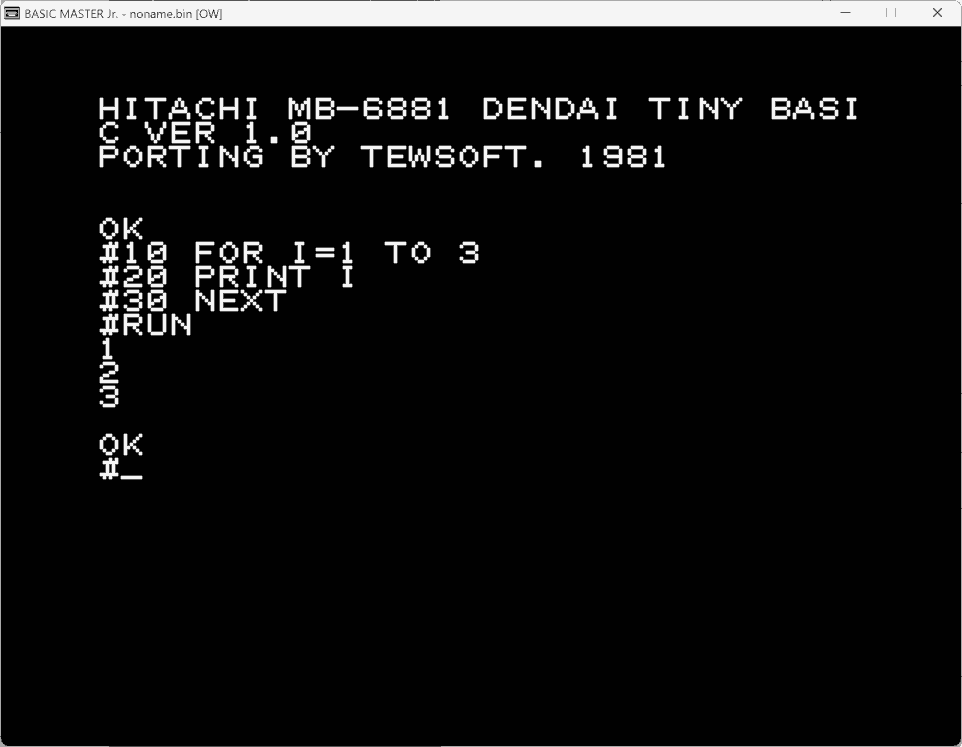

# BASICMASTER/電大版Tiny BASICの移植版

Softwares and Documents for Hitach BASIC MASTER L2/L2II/Jr.

## 電大版TinyBASICとは

電気通信大学で開発されたTiny BASIC。初出は「[マイ・コンピュータをつかう](https://amzn.to/3yoproY)」（安田寿明著 講談社ブルーバックス 1978年4月25日）。後に[Bit誌1978年8月号](https://amzn.to/4bCmak8)に全ソースリストが掲載された。

「だれにでもわかる 続・マイコンの作り方・使い方」（河内洋二著 啓学出版 1981年1月）の付録2(P.190)にダンプリストが掲載されている。

「マイコン手づくり塾」（村岡周平著 広済堂出版 1981年1月）に、RAM誌に連載されていたΛ-1用電大版TinyBASICが掲載されている。

講談社版とbit版はかなりの変更がある（安田氏によるとVersion 1と1.5ぐらいに相当するそうだ）。

***注:***

プログラムを比較してみたが、大きな変更は0ページの使い方である。講談社版は$00から使っているが、bit版では$1Aからとなっている。

残りはバグ修正と思われる変更で、ルーチンの入れ替えは無いようだ。

バグはbit誌1978年9月号によると「整定数文法エラー」と「配列変数評価ルーチン」の2つとなっているが、その他にも修正箇所がある。

## BASICMASTERへの移植

この移植版は1981年にbit誌のソースを元に作成したものです。

大抵の言語処理系は0ページを山ほど使っているので、これをどこに移動するかが常に問題になります。

BASICMASTERではモニタが00-71、BASICが72-FFを使っていてほとんど空きがありません。
(実は$B7-$CDもモニタのMUSICルーチンが使ってるので音を出したい時は使えない）

TinyBASICもモニタサブルーチンを利用するので、前半は使えず、後半のL2 BASICの利用領域を騙し騙し使うしかありません。もちろんL2 BASICと同時に使うと誤動作します。

別のページに移せばいいのですが、そうすると相対ジャンプで届かなくなる場所が発生して、玉突で修正量が大きくなります。少し遅くもなりますし。

この移植版ではL2 BASICの一時的な作業領域である$7A〜を使うようにしています。

電大版TinyBASICは0ページの$82-$B5をA-Zの変数領域として使っています。$82はA($41)を2倍した値です。
さすがにこれだけの領域を使うのはもったいないので、この移植版では別ページにしています。この辺りの話は下記の記事に詳しい。

- [HD6303で電大版TINY BASIC：8bitマイコンで遊ぶ：SSブログ](https://baraki.blog.ss-blog.jp/2018-11-08)

## DENDAI.diffの説明

[MIKBUGプチ拡張 (Old MC6800)](https://oando.web.fc2.com/old_mc6800/f100_414.htm)に載っているTB2KD.ASMとの差分です。Bit誌との差分が理想的ですが再入力する元気はなかった。

- [DENDAI.diff](DENDAI.diff)
- [DENDAI.mot](DENDAI.mot)
- [DENDAI.cmt](DENDAI.cmt)

当時使っていた MB8861 CPU用になっています。ADX #8の部分はBSR INX8に置き換えてください。

## 実行するには

BASICMASTERエミュレーターにDENDAI.mot を読み込ませて、CALL $1000です。
OKプロンプト画面が出れば成功です。

## 資料

- [マイ・コンピュータをつかう](https://amzn.to/3yoproY)」（講談社ブルーバックス 1978年4月25日)（ダンプリスト）
	- bit誌1978年8月号P.51によると『第1刷収録オブジェクト・リスト中，$062B番地の内容「4E」は誤りで，「65」が正しい』『配列式が「評価不能」となる』
	- 『算術代入文中に，整定数の文法エラーがあった場合，第1刷のオブジェクトリストのBASICではHangup状態に陥ることがある』
	- 4EはARRAY JSR FACT2($054E)。正しくはJSR FACT($0565)ということになる。
- [Bit誌1978年8月号](https://amzn.to/4bCmak8)(共立出版)（ソースリスト）
- [マイコン手づくり塾 : コンピュータテクニックを完全マスター - 国立国会図書館デジタルコレクション](https://dl.ndl.go.jp/pid/12627349/1/148)(ソースリスト）1981.1
	- Bit誌掲載バージョンに LLIST,SAVE,LPRINT コマンドが追加されている
	- 入出力ルーチンはΛ-1のCHICK-BUGに合わせてある
	- 特殊文字の入力チェックも少し変更されている
	- アセンブラの制限なのか、LDX #TABLE-2 が LDX #TABLE / DEX / DEX になっている
- [だれにでもわかるマイコンの作り方・使い方 続 - 国立国会図書館デジタルコレクション](https://dl.ndl.go.jp/pid/12627416/1/103)（ダンプリスト）1981.1
	- bit版とほぼ同じ。I/Oアドレスが異なる
- 「電大版TINY BASIC on LKIT-8」ASCII 1978年11月号P.58
	- [エンサイクロペディア・アスキー volume 3 P.382](https://dl.ndl.go.jp/pid/12631628/1/194)
	- 同号のDirect Mail Areaには電大版TinyBASIC利用者からの手紙が多数掲載されている　
- 「石田晴久vs安田寿明 ベストセラーの著者が語る回想とこれから」
	- 電大版TINY BASICの生い立ちが語られている。
	- 月刊ASCII 1979年1月号P.34
	- [エンサイクロペディア・アスキー volume 3 P.346](https://dl.ndl.go.jp/pid/12631628/1/176)

- [MIKBUGプチ拡張 (Old MC6800)](https://oando.web.fc2.com/old_mc6800/f100_414.htm)
- [SBC6303で電大版TinyBASICを動かす | KUNINET BLOG](https://kuninet.org/2018/06/13/sbc6303%E3%81%A7%E9%9B%BB%E5%A4%A7%E7%89%88tinybasic%E3%82%92%E5%8B%95%E3%81%8B%E3%81%99/)
- [HD6303で電大版TINY BASIC：8bitマイコンで遊ぶ：SSブログ](https://baraki.blog.ss-blog.jp/2018-11-08)
- [Nakamozu Tiny Basic /ASCII](https://hyamasynth.web.fc2.com/ACII_NTB/ACII_NTB.html)
- [Bequest333のページ 電大版TINYBASIC for PIC　ミニマムお試し版2](https://www3.hp-ez.com/hp/bequest333/page29)
- [fishhack66/6800-6809-Stuff: Various bits and bobs for the Motorola processors](https://github.com/fishhack66/6800-6809-Stuff/tree/main)

## その他

安田寿明氏は 早くからTinyBASICの可能性を見いだし 雑誌で紹介していた。

- [“Tiny BASIC”への招待①- コンピュートピア1977年3月号 P.85](https://dl.ndl.go.jp/pid/3249995/1/45)
	- 8080版デンバー・タイニイBASICのソースあり
- [“Tiny BASIC”への招待②- コンピュートピア1977年4月号 P.69](https://dl.ndl.go.jp/pid/3249996/1/37)
	- LLL8080（ポテト）BASICインタプリタ ソース・オブジェクトリスト①
- [“Tiny BASIC”への招待③- コンピュートピア1977年5月号 P.55](https://dl.ndl.go.jp/pid/3249997/1/30)
	- LLL8080（ポテト）BASICインタプリタ ソース・オブジェクトリスト②
- [“Tiny BASIC”のすすめ①- コンピュートピア1977年8月号 P.101](https://dl.ndl.go.jp/pid/3250001/1/53)
	- デンバー・タイニイBASICフルアセンブルリスト
- [“Tiny BASIC”のすすめ②- コンピュートピア1977年10月号 P.73](https://dl.ndl.go.jp/pid/3250003/1/39)
	- 各種Tiny BASICの言語仕様・性能比較表あり
