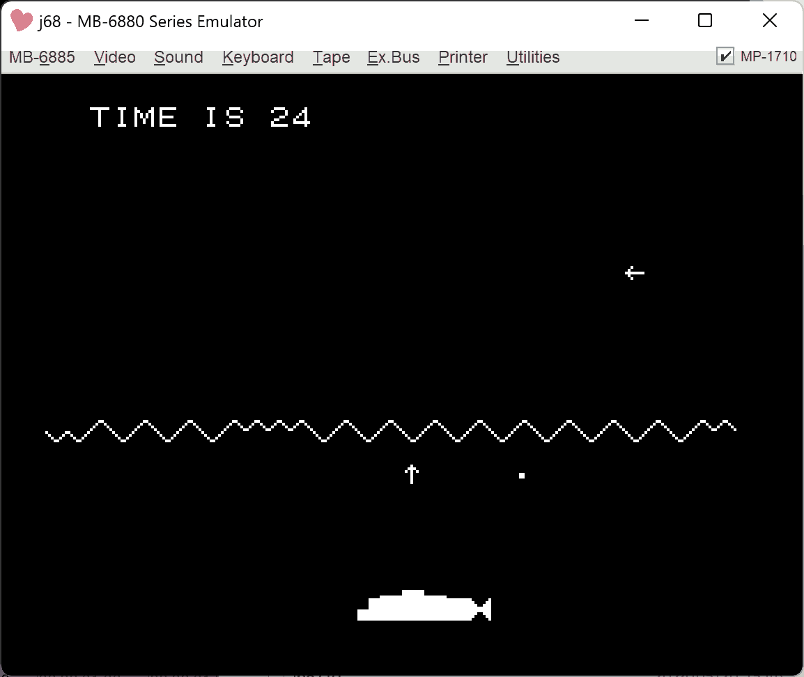

# GAME68 on BASIC MASTER 

GAME68 interpriter for Hitach BASIC MASTER.

## original source code

月刊アスキーの1978年7月号から10月号（エンサイクロペディア・アスキー Vol.2,3）

## 参考にしたソースコード

- https://flexonsbd.blogspot.com/2024/03/6800game6809.html

## DEMO


- YouTube: https://youtu.be/H7nNazKI7cg?si=s2Mx-cjKBpMB6fUf



## 追加機能

SAVE/LOAD/APPENDの仕様は変更するかも。
```
[S FILENAME		SAVE
[L FILENAME		LOAD
[A FILENAME		APPEND
```
以下、GAME/BMに合わせた

論理演算
```
A\&B				AND
A.B				OR
A!B				XOR
```

特殊変数
```
\			TIME1,2	（1秒タイマーの値）
^			CURSOR位置($0F,$10)
^$			CURSOR位置のアドレス(JSR $FFF5)
[			現在のキーボード状態(JSR $F00F)、キー入力がなければ0を返す
[R			キースキャン？（未実装）
```

モニタ、音楽

```
[=0			モニタに移動
[=1	STR		MUSIC
```

## BUG

- bm2で起動時にゴミが表示される（修正済み。初期化漏れがあった）

## 資料

- [エンサイクロペディア・アスキー volume 2 - 国立国会図書館デジタルコレクション](https://dl.ndl.go.jp/pid/10259290)
- [エンサイクロペディア・アスキー volume 3 - 国立国会図書館デジタルコレクション](https://dl.ndl.go.jp/pid/12631628)
- [エンサイクロペディア・アスキー volume 4 - 国立国会図書館デジタルコレクション](https://dl.ndl.go.jp/pid/12631630)
- [エンサイクロペディア・アスキー volume 5 - 国立国会図書館デジタルコレクション](https://dl.ndl.go.jp/pid/12631635)
- [エンサイクロペディア・アスキー volume 6 - 国立国会図書館デジタルコレクション](https://dl.ndl.go.jp/pid/12631585)
- [6809 / 6800とFLEX: 6800用GAMEインタプリタとコンパイラの6809への移植がようやく完成](https://flexonsbd.blogspot.com/2024/03/6800game6809.html)
- [GAME68コンパイラ : 電子工作やってみたよ](https://telmic.exblog.jp/30174191/)
- [GAME68 - ずmemo](https://wiliki.zukeran.org/old/1543448974.html)
