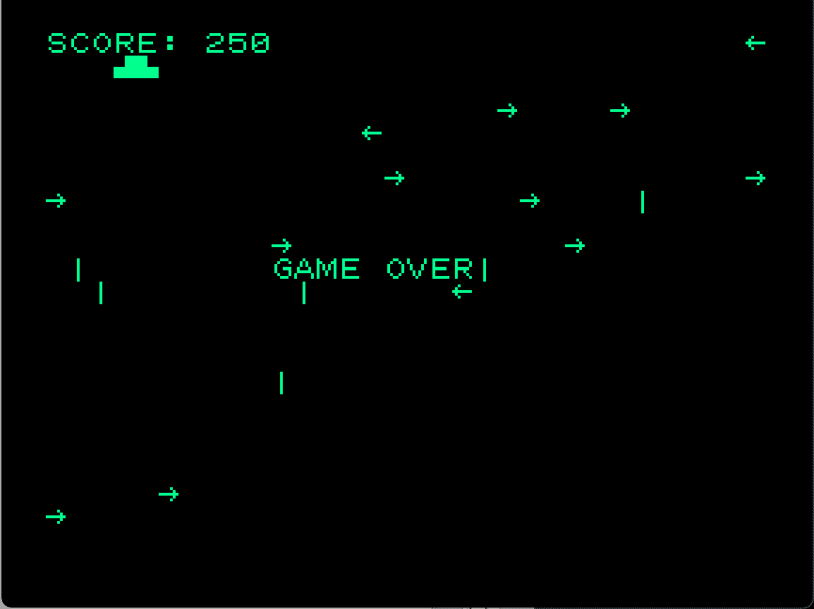

# BASICMASTER

## Tiny Galaxy

自機を操って敵UFOを倒すゲーム

BMUG会報 BASIC MASTER USER'S GROUP No.5 MAY 1982 に投稿したもの

### ファイル一覧

- TinyGalaxy.bas			BASICプログラムテキスト
- TinyGalaxy.bin			機械語プログラム(0x1000-)
- TinyGalaxy.dump.txt		上記のI/Oダンプ形式
- galaxy.bas.cmt			BASICプログラム（エミュレーター用CMT形式）
- galaxy.bin.cmt			機械語プログラム（エミュレーター用CMT形式）
- TinyGalaxy.BMUG198205.pdf	太古の資料のスキャン
- TinyGalaxy.info			f9dasm用info（解析したい方へ）
- TinyGalaxy.asm			上記infoで逆アセンブルしたもの

### 遊び方

- 英数	加速
- V・N	左右移動

### 資料

