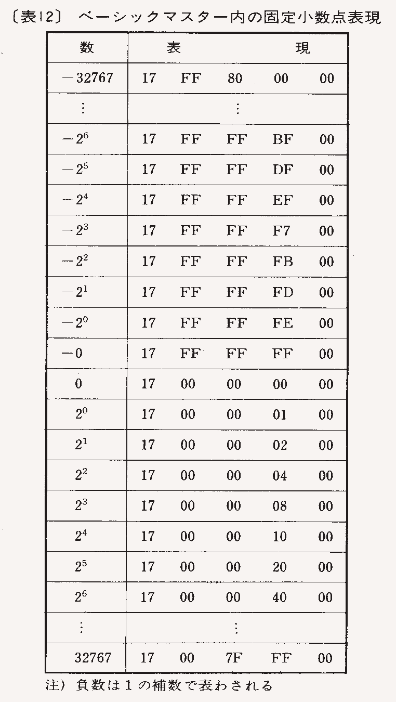

# Hitach BASICMASTER Document

気がついたことをメモします。

## マニュアルのバグ

### BLS命令

MB-6881/MB-6885のマニュアルではBLSの説明として「C BitがセットかあるいはZ Bitがクリアなら」とあるが、これは「Z Bitがセットなら」の誤り。動作説明は "PC←(PC)+0002+Rel, if (C)⊙(Z)=1" であり、正しい。

### Monitor $F00F (KBIN)

MB-6881のマニュアルではキーボードが推されているとC=1と書かれているが、逆(C=0)。
MB-6885のマニュアルでは修正されている

## I/O port $EF40

アクセス後、11マシンサイクル後にNMIがかかる。ステップ実行用。

## I/O port $EFD0

MB-6885のROM/RAM切り替え。回路図IC6の74LS138P(3-Line To 8-Line Decoders)で$40間隔でデコード。
74LS138PのピンY7($EFC0)とアドレスバスA4のANDを取って$EFD0にしている(IC13)。
（同じくA5とのANDでグラフィックディスプレイ切り替え信号を生成している）

IC13のピン8(~ROM MASK)はIC12 74LS175M(Quadruple D-Type Flip-Flop)のCKに入り、データD0-2,4をラッチする。
- D0: ROM MASK1 B000-DFFF 1:RAM, 0:BASIC ROM
- D1: ROM MASK2 E000-EFFF 1:RAM, 0:PRINTER ROM, I/O
- D2: ROM MASK3 F000-FFFF 1:RAM, 0:MONITOR ROM
- D4: TIME OFF 1:ON 0:OFF

D4は回路図2/3につながっているはずだが、回路図が無い…
回路図2/3はブロックダイヤグラムから想像するに、システム系同期信号発生回路、画面表示、拡張端子あたりの回路が含まれていたと思われる)

bm2ではエミュレートされていない。ebmjr、j68はOK。MAMEは調査してない。

cf. [http://cmpslv3.stars.ne.jp/Bmjr/EnrBm.htm](http://cmpslv3.stars.ne.jp/Bmjr/EnrBm.htm)

## L2 BASICの変数表現

2通り。-32767〜32767までの整数か、仮数4バイト・指数1バイトの浮動小数。演算時には仮数をさらに1バイト追加して演算精度を高めている。

仮数部、指数部ともに2の補数形式。仮数部はケチ表現。

8bit指数・1bit符号・31bitの仮数からなる。指数は2の補数。
指数部が$17のときは整数値で、仮数部2バイト目・3バイト目に値が入る。4バイト目は0。1バイト目は2バイト目から符号拡張されている。

## 変数テーブル

$700-
変数名と変数の種別、変数の格納先の4バイトで表される。
配列の場合、格納先に配列の大きさも格納されている。

変数名1文字目1バイト(ASCII)・2バイト目の上位ニブルは変数種別、下位ニブルは変数2文字目(1-9)。変数が1文字の場合は$A。3・4バイト目が変数へのポインタ。未初期化の場合は0000。

変数種別は$00:数値変数、$10:1次元数値変数、$20:2次元変数。文字変数はおのおの$C0を足す。
未初期化時は数値は$70、文字変数は$F0になっている。

## BASIC中間言語

行番号2バイト+行長1バイト+中間言語…

- I/O 1982年10月号 p.266- 「Jr.ユーリティと解析」
	- BASIC中間言語表など

## モニタROM解析記事

月刊マイコンに連載されていた。

- 1980年5月号 機械語とBASICのリンク1 P.49
- 1980年6月号 ASCIN、ASCOUTの使い方 P.152
- 1980年7月号 モニタ解読用逆アセンブラの制作 P.96 その1
- 1980年8月号 ベーシックマスタのモニタ研究 P.113 その2 （画面表示関連）
- 1980年9月号 ベーシックマスタのモニタ研究 P.155 その3 （画面表示関連）
- 1980年10月号 ベーシックマスタのモニタ研究 P.163 その4 （MESOUT,HEXOUT）
- 1980年11月号 ベーシックマスタのモニタ研究 P.148 その5 （ブロック転送用ルーチンMOVBLK）
- 1980年12月号 ベーシックマスタのモニタ研究 P.182 その6 （IRQ、音出力）
- 1980年12月号 L2BASICによるモニタ解読用逆アセンブラ P.187 番外編
- 1981年1月号 ベーシックマスタのモニタ研究 P.192 その7 （割り込み関連)
- 1981年2月号 ベーシックマスタのモニタ研究 P.151 その8 （リセット）
- 1981年3月号 ベーシックマスタのモニタ研究 P.150 その9 （キー入力）
- 1981年4月号 ベーシックマスタのモニタ研究 P.214 その10 （キースキャン）
- 1981年5月号 ベーシックマスタのモニタ研究 P.214 その11 （キースキャン）
- 1981年6月号 ベーシックマスタのモニタ研究 P.180 最終回 （総まとめ）
- 1981年6月号 MB-6880L2ディスク公開・利用記 P.191 （ディスクFDOS、プリンタの解説）

## 機械語入門講座

月刊テクノポリスに連載されていた。全5回。

Jrのグラフィック画面描画プログラム・独自波形の音の出し方が書かれていて貴重。

最終回が振り返りになっているので、1→5→2→3→4の順に読むと良い。

- 1982年10月号 マシン語入門講座 P.145-150
	- ベーシックマスターJrの概要
	- モニタサブルーチンの紹介
	- グラフィック画面への描画（水平線、UFO）
- 1982年12月号 機械語入門講座 P.41-49
	- モニタの使い方
	- 簡単なゲームの骨格
	- 利用するサブルーチン・ワークエリア
- 1983年1月号 機械語入門講座 P.99-103
	- キー入力と移動
	- ゲーム全体の完成
- 1983年2月号 機械語入門講座 P.109-113
	- 音出しのルーチン
	- MUSIC文ではなく、任意波形の音を出す
- 1983年3月号 機械語入門講座 P.101-105
	- 基本の振り返り

## ハードウェア

- [インターフェース 1980年2月号](https://www.cqpub.co.jp/interface/contents/1980/198002.htm) p.62- 「ベーシックマスタを拡張した汎用ラボオートシステムの制作・ソフトウェア編」
	- I/O拡張ポートの使い方、ベーシック・モニタROMの概要が書かれている
- [インターフェース 1980年6月号](https://www.cqpub.co.jp/interface/contents/1980/198006.htm) p.122- 「高解像度カラー・グラフィック装置の製作」
	- 外づけのカラーグラフィック装置の作成
	- 6809を使っていて本体よりも高機能。FM-8/7を思わせる構成
- [インターフェース 1981年5月号](https://www.cqpub.co.jp/interface/contents/1981/198105.htm) p.165- 「ベーシックマスター・レベルⅡの回路図解剖」
	- 全回路図と解説
- RAM 1982年2月号 P.74 「ベーシックマスターJr.の可能性を探る」
	- 内部基盤の写真あり
	- PIA拡張ポート、DMA（パターンの空き部分）の解説あり
- RAM 1982年4月号 P.136 「MB-6880L2 X'tal 交換について」
	- 12MHz〜16MHzの水晶と入れ替える（切り替える）ことにより高速化
	- TVの同期・カセットI/Oの速度も変わるため、実用上は切り替えが必要
	- 著者は16.965MHz（1.06MHz）に高速化している
	- オリジナルは12.07296MHzなので、1.4倍の高速化
- I/O 1982年3月号 p.291- 「ベーシックマスターJr.全回路図集」
- I/O 1982年4月号 p.304- 「Jr.カラーアダプタ［全回路図公開］/アセンブラ」
- I/O 1982年5月号 p.337- 「Jr.カラーアダプタ・グラフィック・ユーティリティ」
- [ベーシックマスター活用研究 : Level 3,Jr](https://dl.ndl.go.jp/pid/12631864/1/66) p.95 「Jr. 全回路図集 P.95」
	- I/O 1982年3,4,5月号に掲載された回路図・アセンブラ・ユーティリティの再録
- I/O 1982年10月号 p.259- 「ベーシックマスターJr.を1,200ボーに!
	- ROM書き換えサービス

## MB-6880/MB-6881 のグラフィック化(256x192)

- BMUG会報 1982年7月号P.10
- BMUG会報 1983年5月号P.3

## MB-6880/MB-6881 のPCG化

- BMUG会報 1982年7月号P.11
 
## MB-6880/MB-6881のJr化

- BMUG会報 1984年12月号 P.4
	- 64KB・裏RAM化
